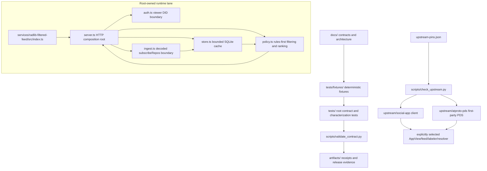

# Repository Code Map

Updated: 2026-08-25

This is a navigation map for the contract-first fork. It records where
behavior lives, which files are contracts or evidence, and where an upstream
change must be made. It is not itself a product specification and it does not
turn generated receipts into implementation claims.

## Read this first

For a change that affects behavior, read these files in order:

1. [`AGENTS.md`](../AGENTS.md) — repository scope, pinned baselines, deferred
   work, and the required contract validator.
2. [`docs/CONSTITUTION.md`](../docs/CONSTITUTION.md),
   [`docs/BLOCKING_SPEC.md`](../docs/BLOCKING_SPEC.md), and
   [`docs/SERVICE_BOUNDARIES.md`](../docs/SERVICE_BOUNDARIES.md) — constitutional
   and authority boundaries.
3. [`docs/RUNTIME_SLICE.md`](../docs/RUNTIME_SLICE.md) — the characterized
   runtime slice and its explicit non-claims.
4. [`upstream-pins.json`](../upstream-pins.json) and
   [`docs/UPSTREAM_INVENTORY.md`](../docs/UPSTREAM_INVENTORY.md) — upstream
   provenance and the supported client/PDS source trees.
5. The focused source and fixture pair named in the relevant section below.

The root contract gate is:

```sh
python3 scripts/validate_contract.py
```

## Architecture at a glance



The repository has three distinct implementation boundaries:

- The root owns contracts, fixtures, tests, release evidence, deployment
  fragments, and the standalone Radlib filtered-feed service.
- `upstream/social-app` owns the client implementation and its client-side
  feature surfaces.
- `upstream/atproto-pds` owns the first-party PDS implementation. AppViewLite
  and FishyFlip checkouts are historical evidence only and are not supported
  runtime dependencies.

## Repository tree

```text
.
├── AGENTS.md                         repository rules and project scope
├── upstream-pins.json                upstream provenance and retrieval metadata
├── codemap/index.md                  this navigation map
├── docs/                             contracts, architecture, reviews, runbooks
├── services/radlib-filtered-feed/    root-owned standalone feed generator
├── scripts/                          validators, checkers, walkthroughs, static server
├── tests/                            Python contract/characterization suite
│   ├── fixtures/                     deterministic JSON contract inputs
│   └── exit/                         exit/readiness harnesses
├── artifacts/                        generated manifests, reports, and receipts
├── deploy/                           static deployment headers and redirects
└── upstream/                         pinned client/PDS submodules and retired evidence
```

The `.gjc/`, `.omc/`, `.planning/`, cache, and local session directories are
working state rather than application architecture and are intentionally not
mapped as runtime components.

## Root-owned runtime: `services/radlib-filtered-feed/`

This is a dependency-light TypeScript service for a self-hosted,
rules-first `app.bsky.feed.getFeedSkeleton` lane. Its service-specific contract
is [`docs/RADLIB_FILTERED_FEED_SERVICE.md`](../docs/RADLIB_FILTERED_FEED_SERVICE.md).

### Composition and modules

| File | Boundary and responsibility | Key symbols or surfaces |
|---|---|---|
| [`src/index.ts`](../services/radlib-filtered-feed/src/index.ts) | Process entrypoint. Reads environment configuration, creates the service, starts the HTTP listener, and closes the store on `SIGINT`/`SIGTERM`. | `RADLIB_FILTERED_FEED_*`, `RADLIB_CONTENT_FILTER_*`, `createRadlibFeedServer` |
| [`src/server.ts`](../services/radlib-filtered-feed/src/server.ts) | HTTP composition root. Owns routes, health/readiness, provider identity, provenance, feed pagination, request errors, and the injection point for provider-resolved viewer context. | `createRadlibFeedServer` at line 41; routes at lines 50–81; `getFeedSkeleton` at line 135 |
| [`src/auth.ts`](../services/radlib-filtered-feed/src/auth.ts) | Authentication boundary. Requires a Bearer token, prefers an injected verifier, and only permits unsigned JWT payload decoding when the explicit development flag is enabled. | `extractViewerDidFromAuthorization` at line 23; `ViewerJwtVerifier` |
| [`src/ingest.ts`](../services/radlib-filtered-feed/src/ingest.ts) | Decoded `com.atproto.sync.subscribeRepos` boundary. Accepts post CREATE/UPDATE/DELETE operations, rejects malformed repository/path data, and writes normalized candidates. | `ingestDecodedSubscribeReposEvent` at line 17; `createSubscribeReposBoundary` at line 65 |
| [`src/store.ts`](../services/radlib-filtered-feed/src/store.ts) | Bounded local persistence using `node:sqlite`. Enforces a maximum post count and TTL, preserves deletes as tombstones, and exposes candidate listing and health checks. | `FeedStore` at line 10; `upsertPost`, `deletePost`, `listCandidates`, `prune` |
| [`src/policy.ts`](../services/radlib-filtered-feed/src/policy.ts) | Pure policy and ranking functions. Normalizes viewer/deployment policy, applies hard-exclusion precedence, performs rules-only whole-term matching, and ranks survivors by freshness/provider/More/Less signals. | `normalizePolicy` at line 31; `evaluateCandidate` at line 59; `rankCandidates` at line 124; `explainPolicy` at line 142 |
| [`src/types.ts`](../services/radlib-filtered-feed/src/types.ts) | Shared service contracts for DIDs, policies, candidates, viewer context, exclusion traces, decoded repository events, and health state. | `ContentFilterPolicy`, `FeedCandidate`, `ViewerPolicyContext`, `CandidateTrace`, `ServiceHealth` |
| [`test/policy.test.ts`](../services/radlib-filtered-feed/test/policy.test.ts) | Unit characterization of normalization, hard exclusions, term matching, ranking, and deterministic ordering. | Policy behavior |
| [`test/store-ingest.test.ts`](../services/radlib-filtered-feed/test/store-ingest.test.ts) | Unit characterization of decoded repository ingestion and bounded SQLite storage. | CREATE/UPDATE/DELETE, TTL, max-post pruning |
| [`test/server-auth.test.ts`](../services/radlib-filtered-feed/test/server-auth.test.ts) | HTTP and authentication characterization. | Bearer/JWT failures, health, feed skeleton, provenance, ingestion, cursors |

### HTTP surfaces

`createRadlibFeedServer` exposes these routes:

- `GET /health` and `GET /ready` — service state for operators.
- `GET /xrpc/_health` — XRPC-style health response, returning `503` when
  unavailable.
- `GET /.well-known/did.json` — provider DID document and feed-generator
  service endpoint.
- `GET /radlib/provenance` — algorithm, policy, persistence, ingestion
  boundary, and health provenance.
- `GET /xrpc/app.bsky.feed.describeFeedGenerator` — feed metadata.
- `GET /xrpc/app.bsky.feed.getFeedSkeleton` — authenticated, bounded,
  cursor-paginated feed skeleton.
- `POST /radlib/ingest/decoded` — token-protected decoded-event ingestion;
  this is not a firehose/WebSocket decoder.

The service deliberately keeps private custom terms and More/Less preferences
out of request headers. Only provider-resolved relationship and labeler
boundaries may enter through `viewerContext`; local terms remain deployment or
viewer policy inputs at the service boundary.

## Root scripts

| File | Role | Use |
|---|---|---|
| [`scripts/validate_contract.py`](../scripts/validate_contract.py) | Required PR-00/PR-01 gate. Checks required documents, pinned metadata, deterministic fixtures, and the A/B/C characterization matrix. | `python3 scripts/validate_contract.py` |
| [`scripts/check_upstream.py`](../scripts/check_upstream.py) | Read-only upstream checkout/provenance checker. It does not fetch moving heads or open automatic pull requests. | `python3 scripts/check_upstream.py --fast` |
| [`scripts/radlib_live_filtered_feed_walkthrough.mjs`](../scripts/radlib_live_filtered_feed_walkthrough.mjs) | Local service walkthrough. Starts the filtered-feed process, indexes deterministic decoded events, checks filtering/provenance, and checks explicit outage behavior. | `node scripts/radlib_live_filtered_feed_walkthrough.mjs` |
| [`scripts/radlib_live_provider_walkthrough.mjs`](../scripts/radlib_live_provider_walkthrough.mjs) | Provider/PDS walkthrough harness. Uses the selected local upstream build surfaces and writes a redacted receipt when its prerequisites are available. | Provider-specific, environment-dependent |
| [`scripts/social_edriffles_static_server.py`](../scripts/social_edriffles_static_server.py) | Small static web server for the social-edriffles/web artifact path. | Script-specific local serving |

## Contract and verification map

The root is contract-first: documents define the boundary, fixtures make
expectations deterministic, tests characterize those expectations, and
artifacts record review or walkthrough evidence. The validator is the final
root-owned composition point.

### Constitutional and relationship contracts

- [`docs/CONSTITUTION.md`](../docs/CONSTITUTION.md),
  [`docs/BLOCKING_SPEC.md`](../docs/BLOCKING_SPEC.md), and
  [`docs/ASSOCIATION_CONSTITUTION.md`](../docs/ASSOCIATION_CONSTITUTION.md)
  define the authority and relationship boundaries.
- [`tests/fixtures/blocking-matrix.json`](../tests/fixtures/blocking-matrix.json)
  and [`tests/test_association_safety_boundaries.py`](../tests/test_association_safety_boundaries.py)
  characterize bilateral blocking and surface separation.
- [`tests/test_contract.py`](../tests/test_contract.py) is the broad root
  contract characterization test.
- `tests/test_constitutional_stack_integration.py` and the four
  `constitutional-stack-*.json` fixtures connect authority, capabilities,
  data-flow prohibitions, and known upstream gaps.

### Attention and feed contracts

- [`docs/ATTENTION_CONSTITUTION.md`](../docs/ATTENTION_CONSTITUTION.md),
  [`docs/ATTENTION_SURFACE_INVENTORY.md`](../docs/ATTENTION_SURFACE_INVENTORY.md),
  and [`docs/FEED_CONSTITUTION.md`](../docs/FEED_CONSTITUTION.md) define the
  attention surface and provider boundaries.
- `tests/test_attention_constitution.py`,
  `test_attention_sovereignty_ui.py`, `test_attention_stack_release_audit.py`,
  `test_experimental_attention.py`, and `test_live_block_presentation.py`
  cover attention and presentation contracts.
- `tests/test_candidate_protocol.py`, `test_balanced_contract.py`,
  `test_feed_prototype_audit.py`, and `test_feed_provider_security.py` cover
  candidate batches, deferred Balanced v1 behavior, feed characterization,
  and provider security.
- [`tests/fixtures/feed-contract.json`](../tests/fixtures/feed-contract.json),
  `candidate-protocol-replay.json`, `balanced-v1-replay.json`,
  `attention-contract.json`, and `feed-provider-security.json` are the main
  deterministic inputs.

### Identity and client/PDS authority

- The contract sources are the `docs/IDENTITY_*.md` family, especially
  [`docs/IDENTITY_AUTHORITY_MODEL.md`](../docs/IDENTITY_AUTHORITY_MODEL.md),
  [`docs/IDENTITY_RUNTIME.md`](../docs/IDENTITY_RUNTIME.md), and
  [`docs/IDENTITY_EXIT_AND_MIGRATION.md`](../docs/IDENTITY_EXIT_AND_MIGRATION.md).
- The focused tests are `test_identity_constitution.py`,
  `test_identity_runtime_contract.py`, `test_identity_recovery_contract.py`,
  `test_identity_sovereignty_ui.py`, and
  `test_identity_stack_ultra_review.py`.
- `identity-contract.json`, `identity-adversarial.json`,
  `identity-runtime-matrix.json`, `identity-recovery.json`, and
  `identity-sovereignty-ui.json` are the corresponding fixture families.
- These semantics belong primarily in the pinned client/PDS sources under
  `upstream/`; the root tests are characterization and release gates, not a
  second client or PDS implementation.

### Service, deployment, and Spaces contracts

- Runtime/deployment sources: [`docs/RUNTIME_TOPOLOGY.md`](../docs/RUNTIME_TOPOLOGY.md),
  [`docs/DEPLOYMENT_ARCHITECTURE.md`](../docs/DEPLOYMENT_ARCHITECTURE.md),
  [`docs/DEPLOYMENT_V1.md`](../docs/DEPLOYMENT_V1.md),
  [`docs/SELF_HOSTING_WEB.md`](../docs/SELF_HOSTING_WEB.md), and
  [`docs/DEPLOYMENT_TROUBLESHOOTING.md`](../docs/DEPLOYMENT_TROUBLESHOOTING.md).
- Service/provider boundaries: [`docs/SERVICE_BOUNDARIES.md`](../docs/SERVICE_BOUNDARIES.md),
  [`docs/SERVICE_CONSTITUTION.md`](../docs/SERVICE_CONSTITUTION.md),
  [`docs/SERVICE_IDENTITY.md`](../docs/SERVICE_IDENTITY.md), and
  [`docs/SERVICE_AUTH_CURRENT_STATE.md`](../docs/SERVICE_AUTH_CURRENT_STATE.md).
- Tests include `test_deployment_v1.py`, `test_provider_boundary_contract.py`,
  `test_service_auth_current_state.py`, `test_live_service_auth.py`,
  `test_social_app_wiring.py`, `test_spaces_alignment_audit.py`, and
  `test_spaces_alpha_integration.py`.
- [`deploy/static-headers`](../deploy/static-headers) and
  [`deploy/static-redirects`](../deploy/static-redirects) are deployment
  inputs, not application routing code.

### Radlib and moderation contracts

- Product boundaries: [`docs/RADLIB_PRODUCT_PRINCIPLES.md`](../docs/RADLIB_PRODUCT_PRINCIPLES.md),
  [`docs/RADLIB_PRODUCT_ACCEPTANCE_REVIEW.md`](../docs/RADLIB_PRODUCT_ACCEPTANCE_REVIEW.md),
  [`docs/RADLIB_CODEX_ACCEPTANCE_REVIEW.md`](../docs/RADLIB_CODEX_ACCEPTANCE_REVIEW.md),
  and [`docs/RADLIB_FILTERED_FEED_SERVICE.md`](../docs/RADLIB_FILTERED_FEED_SERVICE.md).
- Moderation write policy and migration characterization: [`docs/RADLIB_MODERATION_LIST_AUDIT.md`](../docs/RADLIB_MODERATION_LIST_AUDIT.md),
  `tests/test_moderation_list_policy.py`,
  `test_moderation_list_migration.py`, `test_moderation_list_ab_c.py`,
  `test_moderation_list_import.py`, and
  `test_moderation_list_bypass_guard.py`.
- `tests/fixtures/radlib-owner-intent.json` records the owner gate; the
  `radlib-*` and `moderation-list-*` artifacts are evidence and manifests.
- [`docs/APPVIEWLITE_RETIREMENT.md`](../docs/APPVIEWLITE_RETIREMENT.md) is the
  explicit retirement boundary for AppViewLite and FishyFlip.

## Upstream map

| Path | Ownership and supported role | Change procedure |
|---|---|---|
| [`upstream/social-app`](../upstream/social-app) | Pinned social-app client. Client identity, personalization, attention, UI, and provider wiring live here. | Review the observed client paths in `upstream-pins.json`, inspect licenses, update provenance, run focused client checks, then run the root validator. |
| [`upstream/atproto-pds`](../upstream/atproto-pds) | Pinned first-party PDS. Repository writes, identity/auth, CAR import, and fork-specific PDS policy live here. | Review the observed PDS paths in `upstream-pins.json`, inspect licenses, update provenance, run focused PDS checks, then run the root validator. |
| [`upstream-pins.json`](../upstream-pins.json) | Machine-readable source/provenance manifest, including remote URL, branch, commit, checkout commit, license, retrieval date, observed paths, and build command. | Never move a submodule to a moving branch head without updating this file and the dated protocol references. |
| [`upstream/README.md`](../upstream/README.md) | Human-readable submodule initialization and pinning notes. | Keep instructions aligned with the manifest before an upstream maintenance operation. |
| [`upstream/AppViewLite`](../upstream/AppViewLite) and [`upstream/FishyFlip`](../upstream/FishyFlip) | Retired historical checkouts. They are not supported runtime dependencies or active composition points. | Do not reintroduce them without a separately approved architecture change. |

The root repository does not contain a replacement client, PDS, AppView, or
firehose decoder. The standalone feed service accepts decoded repository events
only; a production operator must supply the decoder and verified identity/auth
integration.

## Artifacts and evidence

`artifacts/` contains generated or reviewed evidence rather than source
behavior. Its main families are:

- contract and release reports: `*-test-report.json`, `*-release*.json`, and
  `*-review.json`;
- upstream maintenance: `upstream-baseline.json`,
  `upstream-delta-inventory.json`, `upstream-rebase-risk.json`, and
  `upstream-rebase-receipt.json`;
- live walkthroughs: `radlib-live-*.json`, `live-*.json`, and
  `pds-relay-appview-canaries.json`;
- security/auth receipts: `service-auth-security-observations.json`,
  `oauth-*`, and `receipts/`;
- provenance/manifests: `ecw-*`, `radlib-*manifest.json`, and
  `org-radlib-authority.json`.

Receipts must remain secret-redacted. An artifact can document a live or
fixture-tested observation, but it cannot promote deferred or unsupported
behavior into a runtime claim.

## Change routing

| If the change is about... | Start here | Keep synchronized |
|---|---|---|
| Hard blocks, attention authority, or feed semantics | Relevant `docs/*CONSTITUTION*.md` and `docs/SERVICE_BOUNDARIES.md` | Matching fixture, focused root test, release artifact, and `scripts/validate_contract.py` |
| Standalone filtered-feed behavior | `services/radlib-filtered-feed/src/server.ts` and `src/policy.ts` | `docs/RADLIB_FILTERED_FEED_SERVICE.md`, all three service test files, and the live walkthrough when applicable |
| Feed ingestion or persistence | `src/ingest.ts`, `src/store.ts`, `src/types.ts` | Store/ingest tests, provenance/non-claim text, and health behavior |
| Client UI, identity, personalization, or provider wiring | Matching path under `upstream/social-app` | Upstream pin metadata, focused client tests, root characterization tests, and relevant docs |
| PDS identity, repository writes, CAR import, or moderation policy | Matching path under `upstream/atproto-pds` | Upstream pin metadata, focused PDS tests, root characterization tests, and relevant docs |
| Deployment or static web delivery | `docs/DEPLOYMENT_*.md`, `docs/SELF_HOSTING_WEB.md`, `deploy/` | Deployment fixture, manifest, release review, and validator |
| Upstream version or branch | `upstream-pins.json`, `docs/UPSTREAM_*` | License review, dated protocol references, `scripts/check_upstream.py`, and the root validator |

Do not create a parallel root implementation for behavior already owned by a
pinned upstream source. If the desired behavior is deferred in the project
instructions, record it as a separate approved work item instead of extending
the PR-00/PR-01 contract implicitly.

## Verification commands

From the repository root:

```sh
python3 scripts/validate_contract.py
python3 scripts/check_upstream.py --fast
node scripts/radlib_live_filtered_feed_walkthrough.mjs
```

For the standalone service:

```sh
cd services/radlib-filtered-feed
npm test
```

Provider-specific walkthroughs and upstream builds are environment-dependent.
Do not claim a runtime provider test unless the selected provider source is
available and wired into the focused harness.
