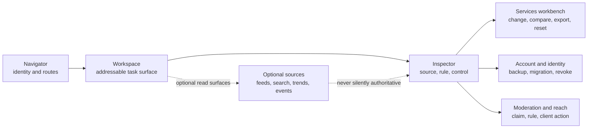

# Plumbline route and seam map

## Purpose

This map turns the Plumbline design specification into a reviewable route
contract. It describes where the existing client presents a task, where it
reveals the responsible service or policy, and where the user changes or
leaves that boundary. It does not create a new router or provider layer.



## Route groups

| Group | Existing routes | Primary work | Seam revealed |
| --- | --- | --- | --- |
| Workspace | `/`, `/search`, `/feeds`, `/lists`, `/saved` | Read and compose | Feed, search, list, and local-policy source |
| Conversation | `/profile/.../post/...`, replies, quotes, liked-by, reposted-by | Inspect a post and its relations | Record address, thread provider, block boundary |
| Communities | `/community` | Join, read, and compose in a selected Space | Community authority, membership, and transport |
| Services | `/settings/services` | Choose and inspect capability providers | Provider, operator declaration, reconciliation, export/reset |
| Identity | `/settings/identity-sovereignty` | Back up, migrate, rotate, and revoke | DID continuity, PDS hosting, recovery custody |
| Moderation | `/moderation` and settings | Apply local reach policy | Label claim, user rule, client action |
| Account | `/profile/...`, `/settings` | Manage profile and permissions | Account repository, active sessions, delegated authority |
| Chat | `/messages` | Use feature-scoped messaging authority | Chat service, grant state, and reauthorization path |

## Responsive transformation

```mermaid
stateDiagram-v2
  [*] --> Workbench: desktop width
  Workbench --> NarrowWorkbench: inspector or rail must defer
  NarrowWorkbench --> MobileShell: mobile breakpoint
  MobileShell --> Workbench: viewport expands
  NarrowWorkbench --> Workbench: viewport expands

  state Workbench {
    Navigator --> Workspace
    Workspace --> Inspector
  }

  state NarrowWorkbench {
    Workspace --> Inspector: inspector remains optional
  }

  state MobileShell {
    Navigator --> Workspace: drawer or bottom navigation
    Workspace --> Inspector: details move below task or Services
  }
```

The workspace remains the primary task surface at every width. The inspector
is deferred before the document stream is made unusably narrow, while
consequential errors and primary actions remain visible.

## Review questions

For any new route or provider-backed surface, review the route against these
questions before calling it Plumbline-complete:

1. What happened, and is the object still addressable?
2. Which provider, actor, labeler, policy, or local rule supplied the result?
3. What can the user inspect, change, compare, revoke, export, or replace?
4. Does a provider outage or disagreement remain visible rather than becoming
   an unexplained empty state?
5. Does the route preserve the existing protocol and browser contracts?
