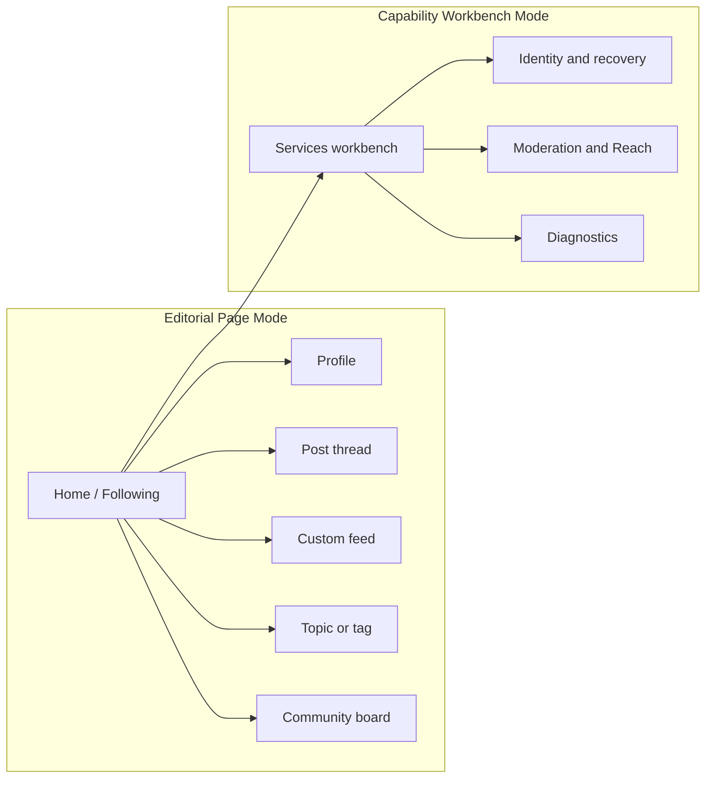

r# Plumbline Page Mode route map

## Route role

- Page Mode routes share the full desktop masthead, index-like navigator,
  editorial document stream, and marginal inspector.
- Workbench Mode routes retain explicit tables, controls, service boundaries,
  policy configuration, and diagnostic affordances.
- Messages remain in their existing specialized split-view behavior rather than
  being forced into either layout by this visual correction.
